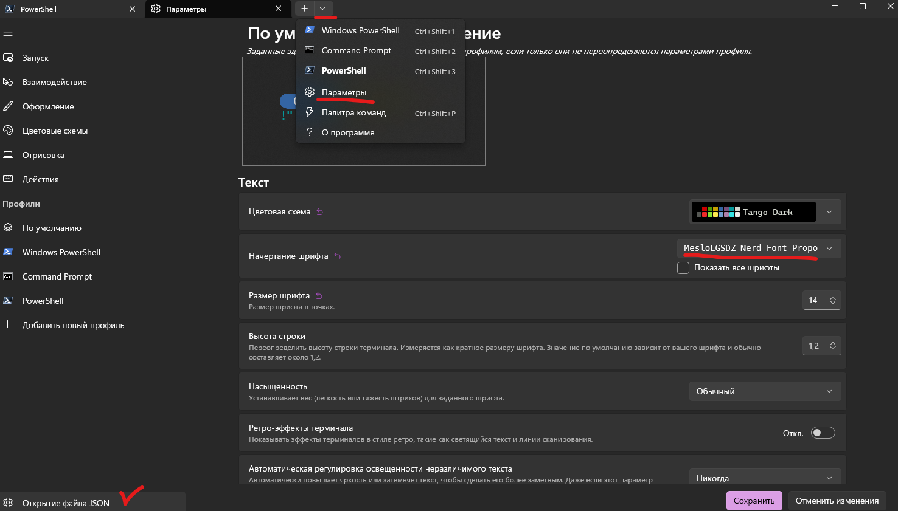

## Настройки PowerShell


### Установка
1. Установить [PowerShell 7](https://learn.microsoft.com/ru-ru/powershell/scripting/install/installing-powershell-on-windows?view=powershell-7.4#msi)

2. Установить [oh-my-posh](https://ohmyposh.dev/docs/) для оформления терминала

3. Настройки для *оформления* powershell в [файле](./settings_ps.json) установить в настройках powershell

- Установить шрифт для терминала, например *MesloLGSDZ NERD FONT Propo*


4. Настройки для oh-my-posh в [файле](./settings_oh_my_posh.json) перенести на компьютер и указать в настройках powershell


5. Настройки модулей и функций для powershell в [файле](./profile.ps1)
для того чтобы открыть файл в powershell выполнить команду
```powershell
code $PROFILE # code - команда для открытия файла в Visual Studio Code
```
- Вставляем содержимое файла [profile.ps1](./profile.ps1) в открывшийся файл

- Меняем для настроек oh-my-posh путь к файлу на свой
```powershell
oh-my-posh init pwsh --config "C:\Users\legion\AppData\Local\Programs\oh-my-posh\themes\mckrei.json"| Invoke-Expression
```
- Сохраняем файл и перезапускаем powershell
